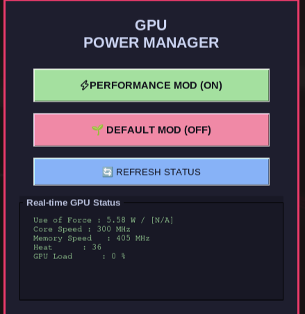

# NVIDIA GPU Power Manager



A sleek and modern Linux desktop utility built with Python and `tkinter` for managing NVIDIA GPU performance states. It allows you to quickly switch between maximum-performance mode and the default balanced power mode while monitoring live GPU telemetry from `nvidia-smi`.

This project is tailored for Arch Linux, CachyOS, and Omarchy systems and uses PolicyKit (`pkexec`) to securely perform privileged GPU configuration changes.

---

## Features

- GPU performance toggle:
  - Switch between maximum performance mode and default power management
  - Uses root privileges via `pkexec`
- Real-time GPU telemetry:
  - Power draw / power limit
  - Core clock speed
  - Memory clock speed
  - GPU temperature
  - GPU utilization
- Modern UI:
  - Catppuccin Mocha-inspired dark theme
  - Minimal and distraction-free design
  - Easy to use desktop interface

---

## Prerequisites

Before running the application, make sure the following are installed on your system:

1. Python 3.x
2. `tkinter` (`python-tk` / `tk`)
3. NVIDIA proprietary drivers
4. `nvidia-smi`
5. `polkit`

For Arch-based systems, install them with:

```bash
sudo pacman -S python tk nvidia-utils polkit
```

---

## Installation and Setup

### 1. Install required dependencies

Run the following command:

```bash
sudo pacman -S python tk nvidia-utils polkit
```

---

### 2. Create the privileged backend script

Create the script at `/usr/local/bin/gpu-mode`:

```bash
sudo tee /usr/local/bin/gpu-mode >/dev/null <<'EOF'
#!/bin/bash

if [ "$EUID" -ne 0 ]; then
  echo "Please run this script with root privileges: sudo gpu-mode [on|off|status]"
  exit 1
fi

case "$1" in
  on)
    echo "=== Enabling maximum GPU performance ==="
    nvidia-smi -pm 1
    nvidia-smi -pl 80
    nvidia-smi --auto-boost-default=0
    nvidia-smi -ac 7000,1545
    echo "✔ Maximum performance mode enabled"
    ;;
  off)
    echo "=== Restoring default GPU power management ==="
    nvidia-smi -acp 0
    nvidia-smi --auto-boost-default=1
    nvidia-smi -pm 0
    echo "✔ Default power management restored"
    ;;
  status)
    echo "=== Current GPU power and clock status ==="
    nvidia-smi --query-gpu=power.draw,power.limit,clocks.gr,clocks.sm,clocks.mem,temperature.gpu --format=csv
    ;;
  *)
    echo "Usage: sudo gpu-mode {on|off|status}"
    exit 1
    ;;
esac
EOF
```

Then make it executable:

```bash
sudo chmod +x /usr/local/bin/gpu-mode
```

---

### 3. Clone the repository

```bash
git clone https://github.com/beraterkek121122/NVIDIA-GPU-Power-Manager.git
cd NVIDIA-GPU-Power-Manager
```

---

### 4. Run the application

```bash
python3 main.py
```

The GUI handles the user-facing controls, while the backend script performs the privileged NVIDIA power management actions.

---

## Project Structure

```text
.
├── main.py          # Main GUI application and telemetry loop
├── gpu-manager.png  # Screenshot / banner asset
├── README.md        # Project documentation
├── LICENSE          # GPL-3.0-or-later
└── ...
```

---

## Troubleshooting

### "Could Not Retrieve GPU Status!"
This usually means `nvidia-smi` could not run successfully.

Check your NVIDIA installation:

```bash
nvidia-smi
```

If it fails, verify that:
- NVIDIA drivers are installed correctly
- Your system is using the proprietary NVIDIA driver
- The GPU is detected properly

### "couldn't connect to display"
This error typically occurs when the application is launched with `sudo` or in an environment without a graphical session.

Run it as a normal user instead:

```bash
python3 main.py
```

The privileged backend work is handled separately through `pkexec` or `sudo`.

### Authorization fails or is cancelled
Switching performance modes requires administrative permission. When prompted, enter your password in the PolicyKit dialog.

---

## License

This project is licensed under the GNU General Public License v3.0 or later.

You are free to redistribute it and/or modify it under the terms of the GNU GPL as published by the Free Software Foundation.

---

## Notes

This tool is intended for GNU/Linux desktop use on supported NVIDIA systems and is especially useful for users who want quick GPU performance control without manually entering terminal commands for each change.
